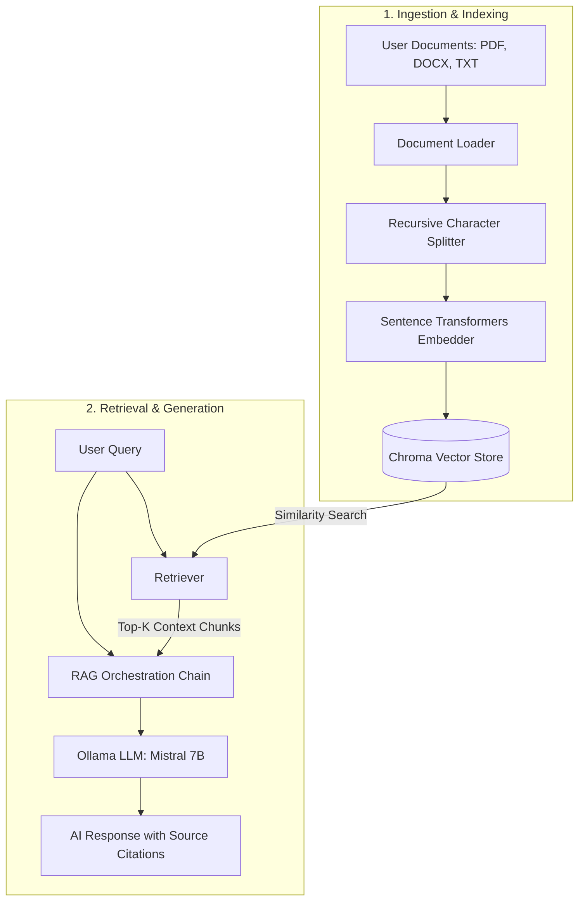
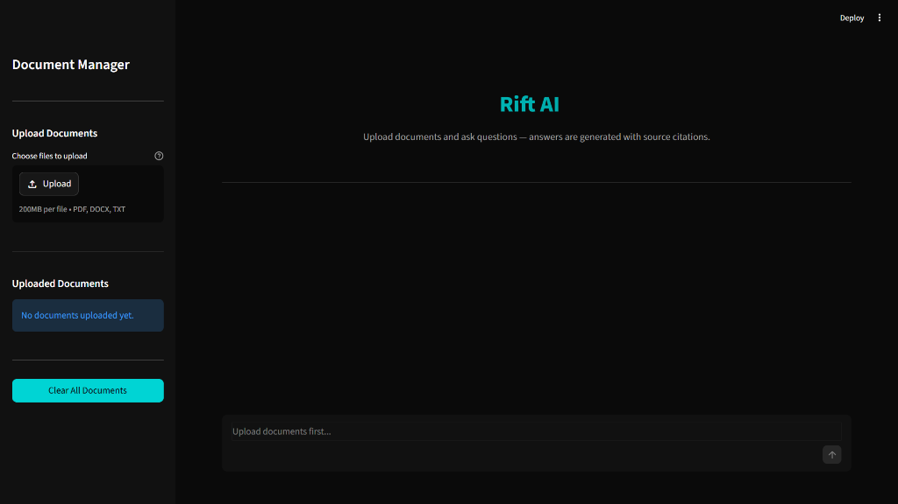

<div align="center">

# ⚡ Rift

### *A secure, fully local Retrieval-Augmented Generation (RAG) system for private document intelligence.*

[](https://www.python.org/)
[](https://github.com/langchain-ai/langchain)
[](https://github.com/chroma-core/chroma)
[](https://ollama.com/)
[](https://streamlit.io/)

</div>

---

## ✨ Key Features

- **📂 Multi-Format Ingestion** — Support for loading PDF, DOCX, and TXT files.
- **✂️ Recursive Chunking** — Splits long documents into smaller chunks using character-based boundaries so you don't lose context.
- **🔒 100% Local & Private** — Runs entirely on your own machine. No external API calls, data collection, or telemetry.
- **🧠 Local Embeddings** — Uses `all-MiniLM-L6-v2` via Sentence Transformers to generate vector embeddings on CPU or GPU.
- **⚡ Persistent DB** — Uses ChromaDB to save and reload embeddings from disk, so you don't have to re-index files every run.
- **🤖 Ollama Integration** — Plugs into a local Ollama instance running `mistral` (7B) for fast, offline text generation.
- **📌 Source Citations** — Every response maps back to the specific source document and page number it was pulled from.
- **🎨 Streamlit Chat UI** — A simple chat interface with a sidebar to upload, view, and clear documents from the active database.

---

## 🏗️ How It Works

Rift bridges local semantic indexing with private on-device generation in two robust phases:



1. **Ingestion & Indexing**: Raw documents (PDF, DOCX, TXT) are read, split using a recursive character text chunker, converted into vector representations using a Sentence Transformers embedding model, and persisted to a local Chroma vector database.
2. **Retrieval & Inference**: When you enter a prompt, Rift executes a similarity search against the Chroma database, extracts the most relevant text chunks, passes the retrieved context along with your query to a local Mistral LLM running via Ollama, and delivers the answer complete with exact source filenames and page citations.

---

## 🛠️ Tech Stack

| Technology | Role | Description |
| :--- | :--- | :--- |
| **Python** | Core Language | Codebase foundation using clean, type-hinted Python 3.10+. |
| **Streamlit** | Frontend UI | Single-page chat interface and document management sidebar. |
| **LangChain** | RAG Orchestration | Coordinates the retrieval steps, prompts, history, and LLM queries. |
| **Sentence Transformers** | Dense Embeddings | Runs `all-MiniLM-L6-v2` locally to turn text chunks into vectors. |
| **ChromaDB** | Vector Database | Stores vector embeddings locally on disk for semantic searches. |
| **Ollama** | Local LLM Engine | Hosts and runs `mistral` (7B) locally for fully offline generation. |

---

## 📸 Screenshots

<div align="center">
  
</div>

---

## 📋 Prerequisites

| Requirement | Version |
| :--- | :--- |
| **Python** | 3.10+ |
| **Ollama** | Latest |
| **Mistral model** | 7B (pulled via Ollama) |

### Install & Configure Ollama

1. Download and install Ollama for your OS from [https://ollama.com](https://ollama.com).
2. Pull the Mistral model to your local machine:
   ```bash
   ollama pull mistral
   ```
3. Verify that the Ollama service is active and running:
   ```bash
   ollama list
   ```

---

## ⚙️ Setup & Installation

### 1. Clone the Repository

```bash
git clone https://github.com/gorintayaswanth77/Rift.git
cd rift
```

### 2. Create and Activate a Virtual Environment

```bash
python -m venv venv

# Windows
venv\Scripts\activate

# macOS/Linux
source venv/bin/activate
```

### 3. Install Dependencies

```bash
pip install -r requirements.txt
```

---

## 🚀 Running the Application

### Option 1: Via standard CLI entry point

```bash
python main.py
```

### Option 2: Directly with Streamlit

```bash
streamlit run ui/streamlit_app.py
```

Once started, the application will open automatically at:
[http://localhost:8501](http://localhost:8501)

---

## 📁 Folder Structure

```
rift/
│
├── app/                        # Core application logic
│   ├── ingestion/
│   │   ├── loader.py           # PDF, DOCX, TXT document loaders
│   │   └── chunker.py          # Recursive text splitting
│   ├── embeddings/
│   │   └── embedder.py         # HuggingFace embedding model
│   ├── vectorstore/
│   │   └── chroma_store.py     # ChromaDB persistence layer
│   ├── retrieval/
│   │   └── retriever.py        # Similarity search retriever
│   ├── llm/
│   │   └── ollama_llm.py       # Ollama/Mistral LLM wrapper
│   ├── chain/
│   │   └── rag_chain.py        # RAG chain orchestration
│   └── utils/
│       └── helpers.py          # File and formatting utilities
│
├── ui/                         # Streamlit frontend
│   ├── streamlit_app.py        # Main app entry point
│   └── components/
│       ├── sidebar.py          # Document upload & management
│       └── chat.py             # Chat interface & history
│
├── data/
│   ├── uploads/                # Uploaded documents (gitignored)
│   └── vectorstore/            # ChromaDB persistence (gitignored)
│
├── config/
│   └── settings.py             # Centralized configuration
│
├── .gitignore
├── requirements.txt
├── README.md
└── main.py                     # CLI entry point
```

---

## 🎛️ Configuration Reference

All application settings are centralized in `config/settings.py` and can be overridden via environment variables:

| Setting | Default | Description |
| :--- | :--- | :--- |
| `CHUNK_SIZE` | `500` | Characters per text chunk |
| `CHUNK_OVERLAP` | `50` | Overlap between chunks |
| `EMBEDDING_MODEL` | `all-MiniLM-L6-v2` | Sentence Transformer model |
| `OLLAMA_MODEL` | `mistral` | Ollama model name |
| `OLLAMA_BASE_URL` | `http://localhost:11434` | Ollama API endpoint |
| `CHROMA_PERSIST_DIR` | `data/vectorstore` | ChromaDB storage path |
| `UPLOAD_DIR` | `data/uploads` | Uploaded file storage path |
| `TOP_K_RESULTS` | `3` | Number of chunks to retrieve |
